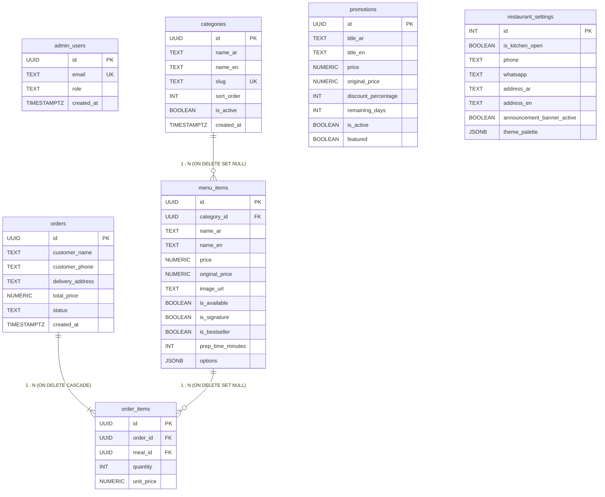

# مواصفات ومخطط لوحة تحكم إدارة المطعم — المرجع الهندسي الشامل (`dashboard_spec.md`)
### Maestro Restaurant — Admin Platform Engineering Blueprint & Functional Specification

> **وثيقة معمارية شاملة (System Specification & Engineering Blueprint):**
> تم استخراج وتوثيق كافة التفاصيل التقنية، نماذج البيانات، قواعد الأعمال، الحسابات الرياضية، المسارات، التكاملات، والبيانات الأولية من الكود المصدري الفعلي للمشروع بالكامل، لتكون دليلاً هندسياً دقيقاً ومستقلاً يُعتمد عليه لإعادة بناء لوحة التحكم من الصفر مع الحفاظ التام والصارم على نفس منطق الأعمال، الحقول، والعمليات.

---

## فهرس المحتويات (Table of Contents)
1. [النظرة العامة والمعمارية التقنية (Architecture & Technical Scope)](#1-النظرة-العامة-والمعمارية-التقنية)
2. [مخطط البيانات وحقول النماذج (Data Schema & Entities)](#2-مخطط-البيانات-وحقول-النماذج)
   - 2.1 جدول المستخدمين الإداريين (`admin_users`)
   - 2.2 جدول فئات وتصنيفات الطعام (`categories`)
   - 2.3 جدول أصناف وقائمة الوجبات (`menu_items` / `meals`)
   - 2.4 كيان خيارات وإضافات الوجبة (`MealOption` / `options`)
   - 2.5 جدول العروض الترويجية الملكية (`promotions`)
   - 2.6 جدول إعدادات المطعم وحالة الفرع (`restaurant_settings` / `site_settings`)
   - 2.7 كيان الجدول الأسبوعي وساعات العمل (`DaySchedule` / `weeklySchedule`)
   - 2.8 كيان رموز وقيم الهوية البصرية والمظهر (`ThemeTokens` / `theme_palette`)
   - 2.9 جداول الطلبات وسلة المشتريات (`orders` & `order_items`)
   - 2.10 مخطط العلاقات والربط الأجنبي (Entity Relationships Diagram)
3. [الوظائف والعمليات وقواعد الأعمال (Functionalities & Business Logic)](#3-الوظائف-والعمليات-وقواعد-الأعمال)
   - 3.1 دورة حياة العمليات والـ CRUD بالتفصيل لكل شاشة
   - 3.2 قواعد وشروط التحقق من صحة المدخلات (Form Validation Rules)
   - 3.3 العمليات والحسابات الرياضية الدقيقة (Formulas & Calculations)
   - 3.4 حالات العناصر وحقول التعداد (Status Enums & Flags)
4. [شاشات وواجهات لوحة التحكم (Dashboard Views & Components)](#4-شاشات-وواجهات-لوحة-التحكم)
   - 4.1 خريطة المسارات وحماية الصلاحيات (Routes & Route Guard)
   - 4.2 تفصيل شاشات اللوحة وعناصر التحكم التفاعلية
   - 4.3 النوافذ المنبثقة ومكونات الحوار المشتركة (Modals & Dialogs)
   - 4.4 الإشعارات الفورية ونظام التنبيهات (Toast Notifications)
5. [التكاملات، التخزين والخدمات (APIs, Storage & State Management)](#5-التكاملات-التخزين-والخدمات)
   - 5.1 استعلامات وعمليات قاعدة البيانات (Supabase Queries & RPCs)
   - 5.2 قنوات المزامنة اللحظية (Supabase Realtime Sync)
   - 5.3 حاويات تخزين الوسائط والصور (Storage Buckets & Media Policies)
   - 5.4 معمارية إدارة الحالة والكونتكست (State Management & Context Architecture)
   - 5.5 ناقل الأحداث المحلي والتخزين الاحتياطي (Event Bus & Local Cache)
   - 5.6 تكامل إرسال الطلبات عبر الواتساب (WhatsApp Direct Checkout)
6. [البيانات الأولية والنموذجية الكاملة (Initial State & Mock/Seed Data)](#6-البيانات-الأولية-والنموذجية-الكاملة)
   - 6.1 مصفوفة الفئات الأولية (`INITIAL_CATEGORIES`)
   - 6.2 مصفوفة الوجبات والأصناف الأولية (`INITIAL_DISHES`)
   - 6.3 مصفوفة العروض الترويجية الملكية (`INITIAL_PROMOTIONS`)
   - 6.4 إعدادات الفرع وبيانات التواصل والدوام الأولية (`DEFAULT_SETTINGS`)
   - 6.5 حزم الألوان وعينات التخصيص الجاهزة (`THEME_PRESETS` & `SWATCHES`)
   - 6.6 حسابات الإدارة الافتراضية (Demo Authentication Accounts)

---

## 1. النظرة العامة والمعمارية التقنية

### 1.1 الهدف والوظيفة
النظام عبارة عن لوحة قيادة وإدارة تشغيلية عليا لمطعم **مايسترو الملكي (El Maestro Royal Restaurant)**، تتيح للإدارة الإشراف الحي والشامل على:
1. متابعة مؤشرات الأداء الحية (KPIs)، وحالة المطبخ واستقبال الطلبات لحظياً.
2. إدارة كتالوج الأطعمة والمأكولات بالكامل (إضافة، تعديل، حذف، نسخ الوجبات، وتحديد التوافر).
3. هيكلة فئات الطعام وترتيبها المخصص وسحبها وترتيبها تصاعدياً.
4. إطلاق العروض وحزم التوفير الملكية، وحساب الخصومات، والعدادات التنازلية للأيام المتبقية.
5. إدارة بيانات الفرع (العنوان الجغرافي، رابط خرائط Google، أرقام الهواتف، والواتساب).
6. جدولة أوقات العمل الأسبوعية لكل يوم بدقة، وتفعيل شريط التنبيهات الإدارية العاجلة.
7. التحكم بالهوية البصرية وقيم الألوان (CSS Color Tokens)، والخطوط العربية، مع محاكاة فورية لواجهة الزبائن وتحليل تباين الألوان وفق معايير الوصول العالمية WCAG 2.1.

### 1.2 معمارية التخزين المزدوج والمقاومة للانقطاع (Dual-Write Resilient Architecture)
يعمل النظام بنمط هجين متطور يجمع بين:
- **المستوى الأول (السحابي - Cloud Master):** قاعدة بيانات **Supabase (PostgreSQL)** مع تفعيل Row Level Security (RLS) ومطابقة الصلاحيات عبر وظيفة `public.is_admin()`.
- **المستوى الثاني (المحلي - Offline-Resilient LocalStorage):** في حال عدم توفر الاتصال، أو وجود مفاتيح Supabase تجريبية أو انقطاع الشبكة، يواصل النظام العمل دون توقف بالاعتماد على مخزن المتصفح `localStorage` مع بث أحداث `CustomEvent` فورية لمزامنة النوافذ المفتوحة.
- **المستوى الثالث (المزامنة اللحظية - Live Realtime Engine):** استقبال التحديثات القادمة من قاعدة البيانات لحظياً عبر قنوات Supabase Realtime ونشرها في الواجهة فور وقوع أي تعديل من أي مدير آخر.

### 1.3 اللغات وتعدد الواجهات (Bilingual Architecture)
- النظام ثنائي اللغة بالكامل:
  - **العربية (`ar`):** الاتجاه من اليمين لليسار (`dir="rtl"`). الخط الافتراضي: `Cairo`.
  - **الإنجليزية (`en`):** الاتجاه من اليسار لليمين (`dir="ltr"`). الخط الافتراضي: Sans-serif / Inter.
- كل كيان يحتوي على حقول مزدوجة متطابقة (مثل: `name_ar` و `name_en`، `description_ar` و `description_en`، `address_ar` و `address_en`).

---

## 2. مخطط البيانات وحقول النماذج

### 2.1 جدول المستخدمين الإداريين (`admin_users`)
- **اسم الجدول في قاعدة البيانات:** `public.admin_users`
- **المفتاح الأساسي:** `id` (يشير إلى `auth.users(id)` مع خاصية `ON DELETE CASCADE`)

| اسم الحقل (Key Name) | نوع البيانات (Data Type) | إجباري / اختياري (Required) | القيمة الافتراضية (Default) | القيود والملاحظات (Constraints & Notes) |
| :--- | :--- | :--- | :--- | :--- |
| `id` | `UUID` | إجباري (Required) | `gen_random_uuid()` | معرف المستخدم الأساسي المطابق لمصادقة Supabase Auth |
| `email` | `TEXT` | إجباري (Required) | لا يوجد | البريد الإلكتروني للمسؤول، قيد فريد (`UNIQUE`) |
| `role` | `TEXT` | إجباري (Required) | `'admin'` | قيد فحص محدد: `CHECK (role IN ('admin', 'manager', 'editor'))` |
| `name` | `TEXT` | اختياري (Optional) | `'مدير النظام'` | اسم العرض المستخرج من بيانات المستخدم `user_metadata.name` |
| `created_at` | `TIMESTAMPTZ` | إجباري (Required) | `NOW()` | تاريخ ووقت إنشاء الحساب على الخادم |
| `lastLoginAt` | `TEXT` (ISO 8601) | اختياري (Optional) | وقت الدخول الحالي | طابع زمني محلي لتسجيل آخر جلسة تسجيل دخول نشطة |

---

### 2.2 جدول فئات وتصنيفات الطعام (`categories`)
- **اسم الجدول في قاعدة البيانات:** `public.categories`
- **المفتاح الأساسي:** `id` (UUID)

| اسم الحقل (Key Name) | نوع البيانات (Data Type) | إجباري / اختياري (Required) | القيمة الافتراضية (Default) | القيود والملاحظات (Constraints & Notes) |
| :--- | :--- | :--- | :--- | :--- |
| `id` | `UUID` / `TEXT` | إجباري (Required) | `gen_random_uuid()` أو `cat-${Date.now()}` | المعرف الفريد للفئة |
| `name_ar` (`nameAr`) | `TEXT` | إجباري (Required) | لا يوجد | اسم الفئة باللغة العربية (مثل: "المشاوي الملكية والكباب") |
| `name_en` (`nameEn`) | `TEXT` | إجباري (Required) | لا يوجد | اسم الفئة باللغة الإنجليزية (مثل: "Royal Grills & Kebabs") |
| `slug` | `TEXT` | إجباري (Required) | مشتق من الاسم أو الطابع الزمني | رابط المسار المختصر (Slug)، فريد (`UNIQUE`)، بأحرف صغيرة |
| `icon` | `TEXT` | اختياري (Optional) | `'Flame'` أو `'Utensils'` | اسم أيقونة Lucide المعبرة عن الفئة (`Flame`, `Utensils`, `Sandwich`, `Crown`, `Sparkles`, `Coffee`, `Pizza`, `Fish`) |
| `sort_order` (`sortOrder`) | `INTEGER` | إجباري (Required) | `0` (أو الترتيب التسلسلي) | ترتيب عرض الفئة في التبويبات والشاشات تصاعدياً (`ASC`) |
| `is_active` (`isActive`) | `BOOLEAN` | إجباري (Required) | `true` | حالة تنشيط الفئة، إذا كانت `false` تُخفى من واجهة العملاء |
| `itemCount` | `INTEGER` | محسوب برمجياً | `0` | حقل مشتق في واجهة المستخدم يمثل عدد الوجبات المرتبطة بهذه الفئة |
| `created_at` | `TIMESTAMPTZ` | إجباري (Required) | `NOW()` | وقت إنشاء السجل |

---

### 2.3 جدول أصناف وقائمة الوجبات (`menu_items` / `meals`)
- **اسم الجدول في قاعدة البيانات:** `public.menu_items` (مع مزامنة الجدول التوافقي `public.meals`)
- **المفتاح الأساسي:** `id` (UUID)

| اسم الحقل (Key Name) | نوع البيانات (Data Type) | إجباري / اختياري (Required) | القيمة الافتراضية (Default) | القيود والملاحظات (Constraints & Notes) |
| :--- | :--- | :--- | :--- | :--- |
| `id` | `UUID` / `TEXT` | إجباري (Required) | `gen_random_uuid()` أو `dish-${Date.now()}` | المعرف الفريد للوجبة |
| `category_id` (`categoryId`) | `UUID` / `TEXT` | اختياري (Optional) | معرف أول فئة متاحة | مفتاح أجنبي يشير إلى `categories(id)` مع خاصية `ON DELETE SET NULL` |
| `name_ar` (`nameAr`) | `TEXT` | إجباري (Required) | لا يوجد | الاسم الكامل للوجبة بالعربية (مطلوب بدون فراغات فارغة) |
| `name_en` (`nameEn`) | `TEXT` | إجباري (Required) | لا يوجد | الاسم الكامل للوجبة بالإنجليزية (مطلوب بدون فراغات فارغة) |
| `title_ar` / `title_en` | `TEXT` | اختياري (Optional) | نفس `name_ar` / `name_en` | أعمدة متزامنة تلقائياً للتوافقية مع المخططات القديمة |
| `description_ar` (`descriptionAr`) | `TEXT` | اختياري (Optional) | `''` | وصف المكونات وطريقة التحضير باللغة العربية |
| `description_en` (`descriptionEn`) | `TEXT` | اختياري (Optional) | `''` | وصف المكونات وطريقة التحضير باللغة الإنجليزية |
| `price` | `NUMERIC` / `INTEGER` | إجباري (Required) | `0` | سعر الوجبة بالليرة السورية (SYP)، قيد: `CHECK (price >= 0)` |
| `original_price` (`originalPrice`) | `NUMERIC` / `INTEGER` | اختياري (Optional) | `undefined` | السعر الأصلي المشطوب قبل الخصم، يجب أن يكون $\ge$ `price` |
| `image_url` (`imageKey`) | `TEXT` | إجباري (Required) | `'shawarma-tower'` | مفتاح تعريف الصورة في السجل أو رابط URL خارجي سحابي |
| `badge` | `TEXT` | اختياري (Optional) | `null` | الشارة التسويقية في قاعدة البيانات (`'Signature'`, `'Best Seller'`, `'Popular'`) |
| `is_available` (`isAvailable`) | `BOOLEAN` | إجباري (Required) | `true` | مفتاح التوفر الحي: متاح للطلب الفوري أم غير متوفر |
| `is_signature` (`isSignature`) | `BOOLEAN` | إجباري (Required) | `false` | مؤشر الوجبات التوقيعية الملكية الخاصة بالشيف |
| `is_bestseller` (`isBestseller`) | `BOOLEAN` | إجباري (Required) | `false` | مؤشر الوجبات الأكثر مبيعاً وإقبالاً |
| `is_spicy` (`isSpicy`) | `BOOLEAN` | إجباري (Required) | `false` | مؤشر الوجبات الحارة |
| `is_new` (`isNew`) | `BOOLEAN` | إجباري (Required) | `false` (أو `true` عند الإضافة) | مؤشر الأصناف المضافة حديثاً |
| `is_vegetarian` (`isVegetarian`) | `BOOLEAN` | اختياري (Optional) | `false` | مؤشر الوجبات النباتية الخالية من اللحوم |
| `is_gluten_free` (`isGlutenFree`) | `BOOLEAN` | اختياري (Optional) | `false` | مؤشر الوجبات الخالية من الغلوتين |
| `prep_time_minutes` | `INTEGER` | اختياري (Optional) | `15` أو `20` | متوسط مدة تجهيز الوجبة بالدقائق |
| `preparation_time` | `TEXT` | اختياري (Optional) | `'15-20 دقيقة'` | نص تمثيل مدة التجهيز باللغة العربية |
| `rating` | `NUMERIC` | اختياري (Optional) | `4.9` (الجديد: `5.0`) | تقييم العملاء (من 1.0 إلى 5.0) |
| `reviews_count` (`reviewsCount`) | `INTEGER` | اختياري (Optional) | `120` (الجديد: `1`) | عدد المراجعات المسجلة |
| `ingredients_ar` (`ingredientsAr`) | `TEXT[]` | اختياري (Optional) | مصفوفة نصوص | مصفوفة المكونات بالعربية (مفصولة بفواصل في النموذج) |
| `ingredients_en` (`ingredientsEn`) | `TEXT[]` | اختياري (Optional) | مصفوفة نصوص | مصفوفة المكونات بالإنجليزية (مفصولة بفواصل في النموذج) |
| `options` | `JSONB` / Array | اختياري (Optional) | `[]` | مصفوفة خيارات الأحجام والإضافات الخاصة بالوجبة (انظر الكيان 2.4) |
| `sort_order` (`sortOrder`) | `INTEGER` | إجباري (Required) | `0` | ترتيب العرض التسلسلي |
| `created_at` | `TIMESTAMPTZ` | إجباري (Required) | `NOW()` | وقت إنشاء السجل |

---

### 2.4 كيان خيارات وإضافات الوجبة (`MealOption` / `options`)
- **طبيعة الكيان:** كائن متداخل (Embedded Object Array) داخل الوجبة وفي سلة الشراء.

| اسم الحقل (Key Name) | نوع البيانات (Data Type) | إجباري / اختياري (Required) | القيمة الافتراضية (Default) | الملاحظات وقواعد الاستخدام |
| :--- | :--- | :--- | :--- | :--- |
| `id` | `TEXT` | إجباري (Required) | `opt-${Date.now()}` | معرف فريد للوجبة الفرعية أو الإضافة |
| `nameAr` | `TEXT` | إجباري (Required) | لا يوجد | اسم الخيار بالعربية (مثل: "حجم كبير"، "إضافة جبنة ذائبة") |
| `nameEn` | `TEXT` | إجباري (Required) | لا يوجد | اسم الخيار بالإنجليزية (مثل: "Large Portion", "Extra Melted Cheese") |
| `priceDiff` | `NUMERIC` / `INTEGER` | إجباري (Required) | `0` | فارق السعر بالليرة السورية ($0$ إذا كان مشمولاً، أو قيمة موجبة إضافية، أو سالبة) |

---

### 2.5 جدول العروض الترويجية الملكية (`promotions`)
- **اسم الجدول في قاعدة البيانات:** `public.promotions`
- **المفتاح الأساسي:** `id` (UUID)

| اسم الحقل (Key Name) | نوع البيانات (Data Type) | إجباري / اختياري (Required) | القيمة الافتراضية (Default) | القيود والملاحظات (Constraints & Notes) |
| :--- | :--- | :--- | :--- | :--- |
| `id` | `UUID` / `TEXT` | إجباري (Required) | `gen_random_uuid()` أو `promo-${Date.now()}` | المعرف الأساسي للعرض الترويجي |
| `title_ar` (`titleAr`) | `TEXT` | إجباري (Required) | لا يوجد | عنوان العرض بالعربية؛ يقبل الفاصل `+` لتفكيك محتويات الباقة |
| `title_en` (`titleEn`) | `TEXT` | إجباري (Required) | لا يوجد | عنوان العرض بالإنجليزية |
| `description_ar` (`descriptionAr`) | `TEXT` | اختياري (Optional) | `''` | تفاصيل ومحتوى العرض باللغة العربية |
| `description_en` (`descriptionEn`) | `TEXT` | اختياري (Optional) | `''` | تفاصيل ومحتوى العرض باللغة الإنجليزية |
| `badge` (`badgeAr` / `badgeEn`) | `TEXT` | اختياري (Optional) | `'عرض خاص'` / `'Special Deal'` | شارة العرض المميزة (مثل: "عرض التوفير الملكي"، "وليمة العائلة") |
| `image_url` (`imageKey`) | `TEXT` | إجباري (Required) | `'shawarma-tower'` | مفتاح صورة العرض أو رابط سحابي مباشر |
| `price` | `NUMERIC` / `INTEGER` | إجباري (Required) | لا يوجد | سعر باقة العرض بعد الخصم بالليرة السورية (SYP) |
| `original_price` (`originalPrice`) | `NUMERIC` / `INTEGER` | إجباري (Required) | لا يوجد | السعر الأصلي المشطوب قبل التخفيض، يجب أن يكون $>$ `price` |
| `discount_percentage` (`discountPercent`) | `INTEGER` | إجباري (Required) | محسوب تلقائياً | نسبة التوفير والخصم من 0 إلى 100% (يمكن للمدير تعديلها يدوياً) |
| `remaining_days` (`remainingDays`) | `INTEGER` | إجباري (Required) | `7` | عدد الأيام المتبقية قبل انتهاء صلاحية العرض الترويجي |
| `expiration_date` (`expirationDate`) | `TEXT` (ISO 8601) | اختياري (Optional) | `undefined` | التاريخ التقويمي الدقيق لانتهاء العرض (إن وُجد) |
| `featured` | `BOOLEAN` | إجباري (Required) | `false` | تمييز العرض كباقة رئيسية بارزة في رأس الصفحة |
| `is_active` (`isActive`) | `BOOLEAN` | إجباري (Required) | `true` | حالة نشر العرض: نشط وظاهر للزبائن أم متوقف مؤقتاً |
| `sort_order` (`sortOrder`) | `INTEGER` | إجباري (Required) | `0` | ترتيب ظهور العرض الترويجي في القائمة |
| `created_at` | `TIMESTAMPTZ` | إجباري (Required) | `NOW()` | وقت إنشاء العرض |

---

### 2.6 جدول إعدادات المطعم وحالة الفرع (`restaurant_settings` & `site_settings`)
- **اسم الجدول في قاعدة البيانات:** `public.restaurant_settings` (مع الحفاظ على التزامن مع `public.site_settings`)
- **المفتاح الأساسي:** `id = 1` (في `restaurant_settings`) و `id = 'primary'` (في `site_settings`)

| اسم الحقل (Key Name) | نوع البيانات (Data Type) | إجباري / اختياري (Required) | القيمة الافتراضية (Default) | القيود والملاحظات (Constraints & Notes) |
| :--- | :--- | :--- | :--- | :--- |
| `id` | `INTEGER` / `TEXT` | إجباري (Required) | `1` / `'primary'` | معرف السجل الفردي الثابت |
| `is_kitchen_open` (`isKitchenOpen`) | `BOOLEAN` | إجباري (Required) | `true` | المفتاح الإداري الرئيسي: هل المطبخ مفتوح ويستقبل الطلبات أم متوقف |
| `delivery_time_ar` (`deliveryTimeAr`) | `TEXT` | إجباري (Required) | `'30 - 45 دقيقة'` | وقت التوصيل التقديري للزبائن بالعربية |
| `delivery_time_en` (`deliveryTimeEn`) | `TEXT` | إجباري (Required) | `'30 - 45 mins'` | وقت التوصيل التقديري للزبائن بالإنجليزية |
| `announcement_banner_active` | `BOOLEAN` | إجباري (Required) | `false` | مفتاح إظهار شريط التنبيهات الإدارية العاجلة في أعلى الموقع |
| `announcement_banner_text_ar` | `TEXT` | إجباري (Required) | نص افتراضي لفرع النبك | نص التنبيه العاجل بالعربية المعروض للزبائن |
| `announcement_banner_text_en` | `TEXT` | إجباري (Required) | نص افتراضي بالإنجليزية | نص التنبيه العاجل بالإنجليزية |
| `phone` (`phonePrimary`) | `TEXT` | إجباري (Required) | `'0969 697 587'` | رقم هاتف الاتصال المباشر الأساسي للطلبات |
| `phoneSecondary` | `TEXT` | اختياري (Optional) | `'011 724 7721'` | رقم الهاتف الأرضي أو الاحتياطي للاستفسارات |
| `whatsapp` (`whatsappNumber`) | `TEXT` | إجباري (Required) | `'0969697587'` / `'963969697587'` | رقم الواتساب المخصص لاستقبال رسائل وفواتير الطلبات |
| `address_ar` (`addressAr`) | `TEXT` | إجباري (Required) | `'سوريا، النبك، شارع أمين'` | العنوان الجغرافي الرسمي للفرع بالعربية |
| `address_en` (`addressEn`) | `TEXT` | إجباري (Required) | `'Syria, Al-Nabek, Amin Street'` | العنوان الجغرافي الرسمي للفرع بالإنجليزية |
| `googleMapsUrl` (`maps_embed_url`) | `TEXT` | إجباري (Required) | رابط خرائط Google الرسمي لشارع أمين بالنبك | الرابط المباشر لموقع المطعم على خرائط غوغل |
| `working_hours_ar` (`workingHoursAr`) | `TEXT` | إجباري (Required) | `'يومياً: 12:00 ظهراً - 02:00 بعد منتصف الليل'` | ملخص أوقات الدوام كنص عام بالعربية |
| `working_hours_en` (`workingHoursEn`) | `TEXT` | إجباري (Required) | `'Daily: 12:00 PM - 02:00 AM'` | ملخص أوقات الدوام كنص عام بالإنجليزية |
| `minOrderAmount` | `NUMERIC` | اختياري (Optional) | `50000` | الحد الأدنى المطلوب لقبول طلب التوصيل بالليرة السورية |
| `deliveryFee` | `NUMERIC` | اختياري (Optional) | `15000` | أجور التوصيل الثابتة الافتراضية بالليرة السورية |
| `taxRatePercent` | `NUMERIC` | اختياري (Optional) | `0` | نسبة الضريبة أو القيمة المضافة المئوية (0 - 100%) |
| `taglineAr` / `taglineEn` | `TEXT` | اختياري (Optional) | شعار مايسترو | الشعار اللفظي الترويجي للعلامة التجارية |
| `aboutStoryAr` / `aboutStoryEn` | `TEXT` | اختياري (Optional) | قصة تأسيس المطعم | نبذة "من نحن" وقصة المطعم المعروضة للزبائن |
| `instagramUrl` / `facebookUrl` / `tiktokUrl` | `TEXT` | اختياري (Optional) | روابط المنصات الرسمية | روابط قنوات التواصل الاجتماعي الرسمية للمطعم |
| `updated_at` (`updatedAt`) | `TIMESTAMPTZ` | إجباري (Required) | `NOW()` | وقت آخر تحديث للإعدادات |

---

### 2.7 كيان الجدول الأسبوعي وساعات العمل (`DaySchedule` / `weeklySchedule`)
- **طبيعة الكيان:** كائن متداخل في إعدادات التشغيل يحدد جدول الـ 7 أيام من السبت إلى الجمعة.

| اسم الحقل (Key Name) | نوع البيانات (Data Type) | إجباري / اختياري (Required) | القيمة الافتراضية (Default) | الملاحظات والقيم المسموحة |
| :--- | :--- | :--- | :--- | :--- |
| `dayId` | `TEXT` | إجباري (Required) | لا يوجد | معرف اليوم الثابت: `'saturday'`, `'sunday'`, `'monday'`, `'tuesday'`, `'wednesday'`, `'thursday'`, `'friday'` |
| `nameAr` | `TEXT` | إجباري (Required) | اسم اليوم بالعربية | "السبت"، "الأحد"، "الإثنين"، "الثلاثاء"، "الأربعاء"، "الخميس"، "الجمعة" |
| `nameEn` | `TEXT` | إجباري (Required) | اسم اليوم بالإنجليزية | "Saturday", "Sunday", "Monday", "Tuesday", "Wednesday", "Thursday", "Friday" |
| `isOpen` | `BOOLEAN` | إجباري (Required) | `true` | هل المطعم يستقبل الزبائن في هذا اليوم أم عطلة أسبوعية |
| `openTime` | `TEXT` | إجباري (Required) | `'12:00'` | وقت فتح المطعم بنظام 24 ساعة (`HH:mm`) |
| `closeTime` | `TEXT` | إجباري (Required) | `'02:00'` | وقت إغلاق المطعم بنظام 24 ساعة (`HH:mm`) |

---

### 2.8 كيان رموز وقيم الهوية البصرية والمظهر (`ThemeTokens` / `theme_palette`)
- **طبيعة الكيان:** كائن JSONB مسجل في `site_settings.theme_palette` ومخزن محلياً في `localStorage['maestro_admin_theme_tokens']`.

| اسم الحقل (Key Name) | نوع البيانات (Data Type) | إجباري / اختياري (Required) | القيمة الافتراضية (Default) | المتغير المقابل في CSS (CSS Variable) |
| :--- | :--- | :--- | :--- | :--- |
| `primaryAccent` | `TEXT` (HEX) | إجباري (Required) | `'#F59E0B'` (ذهبي مايسترو) | `--color-primary`, `--brand-accent`, `--accent-gold` |
| `secondaryAccent` | `TEXT` (HEX) | اختياري (Optional) | `'#D97706'` | `--color-secondary` |
| `darkBg` | `TEXT` (HEX) | إجباري (Required) | `'#06090E'` (أسود مخملي) | `--bg-page`, `--bg-primary`, `--background` (الوضع الداكن) |
| `darkSurface` | `TEXT` (HEX) | إجباري (Required) | `'#131926'` (أوبسيديان مضيء) | `--bg-surface`, `--card` (الوضع الداكن) |
| `darkBorder` | `TEXT` (RGBA/HEX) | إجباري (Required) | `'rgba(245, 158, 11, 0.22)'` | `--border-subtle`, `--border` (الوضع الداكن) |
| `lightBg` | `TEXT` (HEX) | إجباري (Required) | `'#FAF8F5'` (عاجي دافئ) | `--bg-page`, `--bg-primary` (الوضع الفاتح) |
| `lightSurface` | `TEXT` (HEX) | إجباري (Required) | `'#FFFFFF'` (أبيض ناصع) | `--bg-surface`, `--card` (الوضع الفاتح) |
| `lightBorder` | `TEXT` (RGBA/HEX) | إجباري (Required) | `'rgba(226, 232, 240, 0.8)'` | `--border-subtle`, `--border` (الوضع الفاتح) |
| `darkText` / `textPrimary` | `TEXT` (HEX) | إجباري (Required) | `'#FFFDF8'` | `--text-primary`, `--text-main`, `--foreground` (الداكن) |
| `lightText` | `TEXT` (HEX) | إجباري (Required) | `'#0F172A'` | `--text-primary`, `--text-main`, `--foreground` (الفاتح) |
| `fontFamily` | `TEXT` | اختياري (Optional) | `'Cairo'` | `--font-arabic` (`'Cairo'`, `'Readex Pro'`, `'Tajawal'`, `'IBM Plex Sans Arabic'`) |
| `successColor` | `TEXT` (HEX) | اختياري (Optional) | `'#10B981'` | `--color-success` |
| `dangerColor` | `TEXT` (HEX) | اختياري (Optional) | `'#F43F5E'` | `--color-danger` |
| `logoUrl` | `TEXT` | اختياري (Optional) | `''` (يستخدم الشعار الافتراضي) | رابط الشعار أو تمثيل Base64 المرفوع |

---

### 2.9 جداول الطلبات وسلة المشتريات (`orders` & `order_items`)
- **اسم الجداول في قاعدة البيانات:** `public.orders` و `public.order_items`

#### جدول الطلبات (`orders`):
| اسم الحقل (Key Name) | نوع البيانات (Data Type) | إجباري / اختياري (Required) | القيمة الافتراضية (Default) | القيود والملاحظات (Constraints & Notes) |
| :--- | :--- | :--- | :--- | :--- |
| `id` | `UUID` | إجباري (Required) | `gen_random_uuid()` | المفتاح الأساسي للطلب |
| `customer_name` | `TEXT` | إجباري (Required) | لا يوجد | اسم العميل صاحب الطلب |
| `customer_phone` | `TEXT` | إجباري (Required) | لا يوجد | رقم هاتف العميل للتواصل والتوصيل |
| `delivery_address` | `TEXT` | اختياري (Optional) | `null` | العنوان التفصيلي للتوصيل |
| `total_price` | `NUMERIC` | إجباري (Required) | لا يوجد | إجمالي قيمة الطلب بالليرة السورية، قيد: `CHECK (total_price >= 0)` |
| `status` | `TEXT` | إجباري (Required) | `'pending'` | قيد فحص محدد: `CHECK (status IN ('pending', 'confirmed', 'delivered', 'cancelled'))` |
| `created_at` | `TIMESTAMPTZ` | إجباري (Required) | `NOW()` | وقت وتاريخ تسجيل الطلب |

#### جدول عناصر الطلب (`order_items`):
| اسم الحقل (Key Name) | نوع البيانات (Data Type) | إجباري / اختياري (Required) | القيمة الافتراضية (Default) | القيود والملاحظات (Constraints & Notes) |
| :--- | :--- | :--- | :--- | :--- |
| `id` | `UUID` | إجباري (Required) | `gen_random_uuid()` | المفتاح الأساسي للعنصر |
| `order_id` | `UUID` | إجباري (Required) | لا يوجد | مفتاح أجنبي يشير إلى `orders(id)` مع خاصية `ON DELETE CASCADE` |
| `meal_id` | `UUID` | اختياري (Optional) | `null` | مفتاح أجنبي يشير إلى `menu_items(id)` مع خاصية `ON DELETE SET NULL` |
| `quantity` | `INTEGER` | إجباري (Required) | `1` | كمية الوجبة المطلوبة، قيد: `CHECK (quantity > 0)` |
| `unit_price` | `NUMERIC` | إجباري (Required) | لا يوجد | سعر الوحدة الفردية وقت إتمام الطلب بالليرة السورية ($\ge 0$) |

---

### 2.10 مخطط العلاقات والربط الأجنبي (Entity Relationships Diagram)



---

## 3. الوظائف والعمليات وقواعد الأعمال

### 3.1 دورة حياة العمليات والـ CRUD بالتفصيل لكل شاشة

#### 1. إدارة الوجبات وقائمة الطعام (Menu Management CRUD):
- **جلب البيانات (Read / Fetch):**
  - جلب الأصناف من Supabase مرتبة بـ `sort_order ASC`.
  - في حال غياب الاتصال: قراءة المفتاح `maestro_admin_dishes` من `localStorage`؛ وإذا كان فارغاً، يتم بذر البيانات فورياً من مصفوفة `INITIAL_DISHES`.
- **إضافة وجبة جديدة (Create):**
  - إنشاء معرف محلي `dish-${Date.now()}` أو ترك Supabase ينشئ UUID تلقائياً.
  - تعيين القيم الافتراضية: `rating = 5.0`، `reviewsCount = 0`، `isNew = true`، `isAvailable = true`.
  - حفظ السجل محلياً في `localStorage` وبث حدث `maestro:admin-menu-updated`.
  - إرسال استعلام `upsert` لجدول `menu_items` وجدول `meals`.
- **تعديل وجبة موجودة (Update):**
  - مطابقة العنصر عبر `id`، وتحديث كافة الحقول المدخلة، وحفظ المصفوفات المحدثة.
  - إرسال `upsert` لـ Supabase والتحديث الفوري للواجهة مع إظهار إشعار Toast بنجاح الحفظ.
- **تكرار وجبة (Duplicate Dish):**
  - استنساخ كامل الحقول مع إضافة لاحقة `(نسخة)` للاسم العربي و `(Copy)` للاسم الإنجليزي.
  - تعيين `isNew = true`، والحفاظ على نفس التصنيف والمكونات والخيارات وسعر البيع.
- **تبديل حالة التوفر الفوري (Toggle Availability):**
  - تغيير قيمة `isAvailable` مباشرة بنقرة زر واحدة من بطاقة الوجبة أو جدول الإدارة أو لوحة القيادة.
  - إرسال استعلام فوري: `supabase.from('menu_items').update({ is_available }).eq('id', id)`.
- **حذف وجبة (Delete):**
  - فتح نافذة التحذير المنبثقة `ConfirmModal` مع بيان اسم الوجبة بالعربية والإنجليزية وتوضيح أن الإجراء نهائي.
  - عند التأكيد: إزالة الوجبة محلياً وإرسال استعلام `DELETE` إلى Supabase وتحديث العدادات.

#### 2. إدارة فئات الطعام (Category Management CRUD):
- **جلب الفئات (Read):**
  - جلب الفئات مرتبة بـ `sort_order ASC` وحساب عدد الوجبات التابعة لكل فئة `itemCount` حركياً.
- **إضافة وتعديل فئة (Create & Update):**
  - توليد `slug` فريد آلياً من الاسم الإنجليزي إذا تُرك فارغاً.
  - دعم اختيار الأيقونة من قائمة الرموز الثمانية المعرّفة.
  - تعيين الترتيب `sortOrder` إلى نهاية القائمة تلقائياً في حال إضافة فئة جديدة.
- **إعادة ترتيب الفئات (Reorder Categories):**
  - دعم تحريك الفئات يميناً ويساراً (تقديم / تأخير)، وتحديث قيم `sortOrder = index + 1`.
- **حذف فئة (Delete):**
  - إزالة الفئة، وفي حال كان المستخدم يقف على تبويب الفئة المحذوفة، يتم نقله تلقائياً إلى تبويب "جميع الأصناف" (`'all'`). الوجبات التابعة للفئة لا تُحذف، بل يتحول `category_id` إلى `null`.

#### 3. إدارة العروض الترويجية الملكية (Promotions CRUD):
- **جلب العروض:** جلب الصفقات المسجلة وحساب متوسط الخصم وعدد العروض الفعالة.
- **إضافة وتعديل عرض:** حساب نسبة الخصم تلقائياً من السعر الأصلي وسعر العرض، وتحديد مدة الأيام المتبقية (`remainingDays`).
- **تبديل حالة التنشيط:** تمكين أو تعطيل ظهور العرض في واجهة المتجر بنقرة زر واحدة (`toggleActive`).
- **حذف عرض:** فتح نافذة تأكيد الحذف ثم إزالته نهائياً.

#### 4. إعدادات الفرع وساعات العمل (Branch & Operating Settings):
- **تبديل حالة المطبخ الفورية (Master Kitchen Toggle):**
  - زر تشغيلي علوي في الهيدر ولوحة القيادة يحول حالة المطبخ فورياً بين `مفتوح (تشغيل)` و `مغلق (متوقف)`.
  - مزامنة الحقل في جدولي `restaurant_settings` (`is_kitchen_open`) و `site_settings` (`is_restaurant_open`).
- **تكرار ساعات الدوام (Replicate Schedule):**
  - إمكانية نسخ ساعات فتح وإغلاق أي يوم محدد وتطبيقها بنقرة واحدة على كامل أيام الأسبوع الـ 7.
- **تفعيل وإلغاء يوم الجمعة (Friday Off):**
  - مفتاح تبديل مستقل لتعيين يوم الجمعة كعطلة أسبوعية مغلقة أو يوم عمل طبيعي.
- **شريط التنبيهات الإدارية العاجلة (Emergency Banner):**
  - مفتاح تشغيل يظهر شريطاً علوياً أحمر/كهرماني للزبائن في المتجر، مع حقلين للنص العربي والإنجليزي.

#### 5. تخصيص المظهر والهوية البصرية (Theme Customizer):
- **تطبيق الحزم الجاهزة (1-Click Presets):** تطبيق إحدى الحزم الملكية الثلاث المعتمدة بضغطة زر.
- **التعديل الدقيق لقيم الألوان:** محدد ألوان (Native Color Picker) مع حقول إدخال لرموز HEX وعينات سريعة (Swatches).
- **الحقن الديناميكي في شجرة الـ DOM:** توليد عنصر `<style id="maestro-admin-dynamic-palette">` في رأس الصفحة وحقن متغيرات CSS في `:root` والسمات `[data-theme='dark']` و `[data-theme='light']`.
- **استعادة ضبط المصنع للعلامة:** زر استعادة يعيد الألوان لسمة مايسترو الذهبية الفاخرة المعتمدة.

---

### 3.2 قواعد وشروط التحقق من صحة المدخلات (Form Validation Rules)

| النموذج / الشاشة | الحقل المستهدف | قاعدة التحقق (Validation Rule) | رسالة الخطأ والسلوك عند الفشل |
| :--- | :--- | :--- | :--- |
| **تسجيل الدخول** | `emailOrUsername` | نص غير فارغ بعد إزالة المسافات (`trim()`). | *"يرجى إدخال اسم المستخدم وكلمة المرور"* مع تأثير اهتزاز الحاوية (Shake Effect). |
| **تسجيل الدخول** | `password` | نص غير فارغ؛ للبيئات التجريبية طول كلمة المرور $\ge 6$ أحرف. | منع الإرسال وعرض رسالة خطأ باللون الأحمر. |
| **نموذج الوجبة** | `nameAr` | نص إجباري غير فارغ، طوله الأدنى حرف واحد بعد `trim()`. | *"اسم الوجبة بالعربية مطلوب"* وتحديد الحقل بإطار أحمر. |
| **نموذج الوجبة** | `nameEn` | نص إجباري غير فارغ، طوله الأدنى حرف واحد بعد `trim()`. | *"اسم الوجبة بالإنجليزية مطلوب"* وتحديد الحقل بإطار أحمر. |
| **نموذج الوجبة** | `categoryId` | قيمة محددة غير فارغة تطابق إحدى الفئات المتاحة. | *"يرجى اختيار تصنيف الوجبة"*. |
| **نموذج الوجبة** | `price` | رقم موجب قطعي ($> 0$). | *"يرجى إدخال سعر صحيح أكبر من الصفر"*. |
| **نموذج الوجبة** | `originalPrice` | اختياري؛ إذا أُدخل يجب أن يكون رقماً $\ge$ `price`. | في حال كان أقل من السعر الأساسي يظهر تنبيه. |
| **نموذج الوجبة** | `prepTimeMinutes` | رقم صحيح موجب $\ge 1$ (الافتراضي 15). | يُصحح تلقائياً للقيمة 15 في حال تركه فارغاً. |
| **نموذج الفئة** | `nameAr` | نص إجباري غير فارغ. | *"اسم الفئة بالعربية مطلوب"*. |
| **نموذج الفئة** | `nameEn` | نص إجباري غير فارغ. | *"اسم الفئة بالإنجليزية مطلوب"*. |
| **نموذج الفئة** | `slug` | نص اختياري؛ يتم تنظيفه وتحويله لأحرف صغيرة وشرطات. | في حال تركه فارغاً يتم توليده تلقائياً من الاسم الإنجليزي أو الطابع الزمني. |
| **نموذج العرض** | `titleAr` | نص إجباري غير فارغ (يقبل رمز `+`). | *"عنوان العرض بالعربية مطلوب"*. |
| **نموذج العرض** | `titleEn` | نص إجباري غير فارغ. | *"عنوان العرض بالإنجليزية مطلوب"*. |
| **نموذج العرض** | `price` | رقم موجب قطعي ($> 0$). | *"يرجى إدخال سعر العرض"*. |
| **نموذج العرض** | `originalPrice` | رقم موجب قطعي ويجب أن يتجاوز سعر العرض (`originalPrice > price`). | *"السعر الأصلي يجب أن يكون أكبر من سعر العرض"*. |
| **الإعدادات** | `phonePrimary` / `whatsapp` | أرقام هواتف غير فارغة. | يتم تنظيفها باستخدام `.replace(/[^0-9]/g, '')` لإنشاء روابط الاتصال ورسائل الواتساب. |
| **الإعدادات** | `deliveryFee` / `minOrder` | قيم رقمية غير سالبة ($\ge 0$). | تُضبط إلى `0` كحد أدنى. |
| **تخصيص الألوان** | كود الـ HEX | تنسيق صالح يبدأ بـ `#` متبوعاً بـ 6 رموز ست عشرية (`#RRGGBB`). | يتم فحص الكود وتصحيحه تلقائياً أو الرجوع للون الافتراضي `#F59E0B`. |

---

### 3.3 العمليات والحسابات الرياضية الدقيقة (Formulas & Calculations)

#### 1. معادلة حساب نسبة خصم العروض الترويجية (Discount Percentage):
تُحسب نسبة الخصم المئوية تلقائياً بمجرد إدخال السعر المخفض والسعر الأصلي وفق المعادلة:
$$\text{discountPercentage} = \begin{cases} 
\text{round}\left( \frac{\text{originalPrice} - \text{price}}{\text{originalPrice}} \times 100 \right) & \text{إذا كان } \text{originalPrice} > \text{price} > 0 \\
0 & \text{خلاف ذلك}
\end{cases}$$

#### 2. معادلة حساب مقدار التوفير المالي للزبون (Customer Savings Amount):
$$\text{savingsAmount} = \max(0, \text{originalPrice} - \text{price})$$

#### 3. معادلة حساب إجمالي السلة والطلب (Cart & Order Financial Pipeline):
لكل عنصر مضاف إلى سلة الطلب:
$$\text{itemUnitPrice} = \text{basePrice} + \sum \text{option.priceDiff}$$
$$\text{itemLineTotal} = \text{itemUnitPrice} \times \text{quantity}$$
المجموع الفرعي لكامل الطلب:
$$\text{subtotal} = \sum_{i \in \text{items}} \text{itemLineTotal}_i$$
المجموع الكلي النهائي (Grand Total):
$$\text{taxAmount} = \text{round}\left( \text{subtotal} \times \frac{\text{taxRatePercent}}{100} \right)$$
$$\text{grandTotal} = \text{subtotal} + \text{deliveryFee} + \text{taxAmount}$$

#### 4. معادلة تفكيك عنوان العرض الترويجي لبنود مستقلة (Bundle Item Parsing):
عند وجود الرمز `+` في عنوان العرض، يتم تحليله لإنتاج وسوم صغيرة تدل على مكونات الباقة:
$$\text{itemsArray} = \text{titleAr}.\text{split}('+').\text{map}(s \Rightarrow s.\text{trim}()).\text{filter}(\text{Boolean})$$

#### 5. معادلة تعداد وجبات الفئات الحركي (Category Item Counting):
$$\text{category.itemCount} = \sum_{d \in \text{dishes}} [d.\text{categoryId} = \text{category.id}]$$

#### 6. معادلة حساب تباين الألوان ومعايير إمكانية الوصول (WCAG 2.1 & YIQ Luminance):
تُستخدم لتقييم تباين زر الإجراءات تلقائياً وتحديد ما إذا كان لون النص يجب أن يكون أسود داكن (`#0B0F17`) أو أبيض ناصع (`#FFFFFF`):
- **معيار السطوع الإدراكي (YIQ Formula):**
  $$\text{YIQ} = \frac{(R \times 299) + (G \times 587) + (B \times 114)}{1000}$$
  $$\text{OptimalTextColor} = \begin{cases} 
  \#0B0F17 & \text{إذا كان } \text{YIQ} \ge 128 \\
  \#FFFFFF & \text{إذا كان } \text{YIQ} < 128
  \end{cases}$$
- **معيار السطوع النسبي للـ W3C (Relative Luminance):**
  $$L = 0.2126 \times R_{\text{lin}} + 0.7152 \times G_{\text{lin}} + 0.0722 \times B_{\text{lin}}$$
  حيث $C_{\text{lin}} = \frac{C}{255 \times 12.92}$ إذا كانت القيمة $\le 0.03928$ وإلا $\left(\frac{C/255 + 0.055}{1.055}\right)^{2.4}$.
- **نسبة التباين (Contrast Ratio):**
  $$\text{Ratio} = \frac{L_1 + 0.05}{L_2 + 0.05} \quad (\text{حيث } L_1 > L_2)$$
  - إذا كانت النسبة $\ge 7.0:1 \implies$ مستوى **AAA** (فائق الوضوح).
  - إذا كانت النسبة $\ge 4.5:1 \implies$ مستوى **AA** (مطابق للمواصفات القياسية).
  - إذا كانت النسبة $< 4.5:1 \implies$ مستوى **FAIL** (تباين منخفض يُنصح بتعديله).

---

### 3.4 حالات العناصر وحقول التعداد (Status Enums & Flags)

#### 1. حالات الطلبات (`Order Status`):
- `'pending'`: طلب جديد معلق في انتظار المراجعة.
- `'confirmed'`: تم قبول الطلب واعتماده وجارٍ تجهيزه في المطبخ.
- `'delivered'`: تم توصيل الطلب بنجاح للزبون وتسليم القيمة.
- `'cancelled'`: طلب ملغى.

#### 2. الأدوار الإدارية (`Admin Roles`):
- `'admin'`: صلاحيات مطلقة كاملة (إدارة الوجبات، الأسعار، الإعدادات، المظهر، والمستخدمين).
- `'manager'`: صلاحيات تشغيلية (تعديل ساعات العمل، حالة المطبخ، توفر الوجبات، والعروض).
- `'editor'`: صلاحيات تحرير المحتوى (تحديث نصوص الوجبات، الأوصاف، والترجمات).

#### 3. الشارات التسويقية والغذائية للوجبات (Dietary & Promotional Flags):
- `isAvailable`: (Boolean) توفر الوجبة للطلب المباشر في المتجر.
- `isSignature`: (Boolean) صنف ملكي توقيعي حصري للشيف.
- `isBestseller`: (Boolean) صنف عالي المبيعات والأكثر طلباً.
- `isSpicy`: (Boolean) صنف حار يحتوي على الفلفل أو التوابل الحارة.
- `isNew`: (Boolean) صنف أُضيف حديثاً للقائمة.
- `isVegetarian`: (Boolean) صنف نباتي بالكامل.
- `isGlutenFree`: (Boolean) صنف خالي من الغلوتين.

#### 4. مرشحات وتصنيفات العرض في واجهة القائمة:
- **مرشح التوفر (`MenuStatusFilter`):** `'all'` \| `'available'` \| `'unavailable'`.
- **مرشح العلامات الغذائية (`MenuTagFilter`):** `'all'` \| `'signature'` \| `'spicy'` \| `'bestseller'` \| `'vegetarian'` \| `'new'`.
- **خيارات الفرز (`SortOption`):**
  - `'default'`: الترتيب الافتراضي للنظام.
  - `'price-asc'`: السعر من الأقل إلى الأعلى.
  - `'price-desc'`: السعر من الأعلى إلى الأقل.
  - `'prep-time'`: وقت التحضير الأسرع.
  - `'name'`: الترتيب الأبجدي بحسب اللغة المختارة.
- **نمط العرض (`ViewMode`):** `'table'` (جدول متقدم) أو `'grid'` (شبكة بطاقات مرئية).

---

## 4. شاشات وواجهات لوحة التحكم

### 4.1 خريطة المسارات وحماية الصلاحيات (Routes & Route Guard)

| المسار (Route Path) | المكون (Page Component) | حالة الحماية (Access Control) | الوصف والدور الوظيفي |
| :--- | :--- | :--- | :--- |
| `/` | `StorefrontPage` | مسار عام (Public) | واجهة المتجر العامة للزبائن (شريط التنبيهات، القائمة، السلة). |
| `/admin/login` | `AdminLoginPage` | مسار عام للضيوف | بوابة تسجيل دخول المسؤولين؛ يعيد التوجيه لـ `/admin` إذا كانت هناك جلسة نشطة. |
| `/admin` | `AdminDashboardPage` | محمي بـ `AdminRouteGuard` | لوحة القيادة التنفيذية، مؤشرات الأداء الحية، ومفتاح حالة المطبخ. |
| `/admin/menu` | `AdminMenuPage` | محمي بـ `AdminRouteGuard` | الإدارة الشاملة لقائمة الطعام، الفئات، جدول الوجبات، وتعديل الأصناف. |
| `/admin/promotions` | `AdminPromotionsPage` | محمي بـ `AdminRouteGuard` | إدارة العروض الملكية، حزم التوفير، ونسب الخصم، والعدادات التنازلية. |
| `/admin/settings` | `AdminSettingsPage` | محمي بـ `AdminRouteGuard` | إعدادات الفرع، ساعات الدوام الأسبوعية، رسوم التوصيل، وشريط التنبيهات. |
| `/admin/theme` | `AdminThemePage` | محمي بـ `AdminRouteGuard` | محرر الألوان والخطوط ومحاكي العرض الحي وتحليل التباين. |
| `/admin/*` | إعادة توجيه (`Navigate`) | محمي | أي مسار داخلي غير معروف يُعاد توجيهه تلقائياً إلى `/admin`. |
| `*` | إعادة توجيه (`Navigate`) | مسار عام | أي مسار عشوائي يُعاد توجيهه إلى الصفحة الرئيسية `/`. |

#### آلية عمل حارس المسار (`AdminRouteGuard`):
1. يفحص حالة `isLoading`: يعرض مؤقت تحميل فاخر (Luxury Loader) أثناء التأكد من الجلسة.
2. إذا كان `isAuthenticated === false`: يعترض الطلب ويقوم بإعادة التوجيه فورياً إلى `/admin/login` مع حفظ المسار المطلوب في `location.state.from` للعودة إليه بعد نجاح الدخول.
3. يمنع تسريب العرض عند الضغط على زر الرجوع في المتصفح بعد تسجيل الخروج.

---

### 4.2 تفصيل شاشات اللوحة وعناصر التحكم التفاعلية

#### 1. شاشة تسجيل الدخول (`AdminLoginPage`):
- **حقول الإدخال:**
  - حقل اسم المستخدم أو البريد (`emailOrUsername`) مع أيقونة البريد.
  - حقل كلمة المرور (`password`) مع زر إظهار/إخفاء كلمة المرور (`Eye` / `EyeOff`).
  - خيار تذكر تسجيل الدخول (`rememberMe`).
- **الإجراءات:**
  - زر الإرسال الرئيسي مع مؤشر تحميل متحرك.
  - زر التعبئة السريعة التجريبية (Quick Demo Fill) لتعبئة `admin@elmaestro.com` و `admin123`.
  - زر تبديل اللغة أعلى الصفحة وزر العودة إلى المتجر العام.

#### 2. لوحة القيادة التنفيذية (`AdminDashboardPage`):
- **رأس الصفحة ومفتاح المطبخ الرئيسي:**
  - مؤشر تشغيلي نبضي أخضر لحالة النظام المباشرة.
  - مفتاح تبديل حالة المطبخ (Master Kitchen Switch) للفتح والإغلاق بنقرة واحدة مع توضيح الحالة ("مفتوح (تشغيل)" باللون الأخضر أو "مغلق (إيقاف)" باللون الأحمر).
- **بطاقات مؤشرات الأداء الحية (KPI Telemetry):**
  1. *أصناف القائمة الملكية:* إجمالي الوجبات وعدد الوجبات المتاحة حالياً للطلب (ينقل إلى شاشة القائمة عند النقر).
  2. *فئات الطعام النشطة:* عدد أقسام الطعام النشطة.
  3. *العروض الملكية النشطة:* عدد الباقات المفعلة في واجهة الزبائن.
  4. *سرعة التوصيل المتوقعة:* متوسط مدة التوصيل الحالية لمدينة النبك وما حولها.
- **شريط الاختصارات والإجراءات السريعة (Quick Command Bar):**
  - روابط مباشرة سريعة إلى: إضافة وجبة، إطلاق عرض، تعديل الدوام الأسبوعي، ومحرر الألوان.
- **قائمة الوجبات التوقيعية والأكثر طلباً (Signature & Bestseller Roster):**
  - استعراض أول 8 وجبات مميزة مع صورة الوجبة وسعرها وفئتها.
  - تبديل مباشر لحالة التوفر بنقرة زر بدون فتح النماذج.
  - زر تعديل سريع يفتح `MealFormModal`.
  - زر حذف سريع يفتح `ConfirmModal`.
- **بطاقة ملخص الفرع التشغيلي (Branch Operational Profile):**
  - استعراض اسم المطعم، هاتف الطلبات، ساعات العمل، والعنوان الرسمي بالنبك مع زر للانتقال لصفحة الإعدادات.

#### 3. شاشة إدارة القائمة والوجبات (`AdminMenuPage`):
- **التحكم بالرأس:**
  - زر "إدارة التصنيفات" (يفتح نافذة الفئات).
  - زر "إضافة وجبة جديدة" (يفتح `MealFormModal`).
- **بطاقات الإحصائيات الأربع:**
  - إجمالي الوجبات، الوجبات المتوفرة، الفئات النشطة، والوجبات المعطلة مؤقتاً.
- **شريط تبويبات الفئات التفاعلي (`CategoryNavTabs`):**
  - زر "جميع الأصناف" مع عداد إجمالي الوجبات.
  - أزرار الفئات مع أيقونة كل فئة وعدد وجباتها.
  - أزرار التحكم المصغرة المدمجة في كل تبويب: زر تقديم الترتيب، زر تأخير الترتيب، زر تعديل الفئة، وزر حذف الفئة.
- **شريط البحث والتصفية والفرز المتطور:**
  - حقل بحث فوري يبحث في الاسم العربي والإنجليزي، الوصف، والمكونات.
  - قائمة الفرز المنسدلة (السعر تصاعدياً/تنازلياً، مدة التحضير، الاسم أبجدياً).
  - مفتاح نمط العرض (جدول `table` أو بطاقات `grid`).
  - شرائح التصفية السريعة (Filter Chips): الكل، متوفر، غير متوفر، الأكثر طلباً، المخفضة، توقيع الشيف، حار.
- **عرض الجدول المتقدم (`AdminMenuTable`):**
  - أعمدة: صورة واسم الوجبة ووصفها، التصنيف، السعر ونسبة الخصم، وقت التحضير، الشارات الغذائية، مفتاح التوفر الفوري، وأزرار الإجراءات (تعديل، تكرار النسخ، حذف).
- **عرض البطاقات المرئية (`MealCard`):**
  - بطاقات غنية تتضمن صورة الوجبة، شارات الخصم وتوقيع الشيف، بطاقة التوفر، وتفاصيل الأسعار والأزرار.

#### 4. شاشة العروض الملكية (`AdminPromotionsPage`):
- **التحكم بالرأس:** زر "إنشاء عرض ملكي" (يفتح `PromoFormModal`).
- **بطاقات المؤشرات:** إجمالي العروض، العروض المفعلة حالياً، ومتوسط نسبة الخصومات.
- **شبكة بطاقات العروض (`PromoCard`):**
  - صورة العرض والشارة التسويقية ونسبة الخصم المئوية.
  - عداد الأيام المتبقية (`remainingDays`).
  - عنوان العرض ووصفه وحساب مبلغ التوفير الصافي.
  - مفتاح تشغيل/تعطيل العرض (`isActive`).
  - أزرار تعديل وحذف العرض.

#### 5. شاشة إعدادات الفرع والدوام (`AdminSettingsPage`):
مقسمة إلى 4 ألسنة تبويب داخلية:
1. **الهوية والقصة (`identity`):** اسم المطعم بالعربية والإنجليزية، الشعار اللفظي، قصة المطعم، وروابط منصات التواصل (Instagram, Facebook, TikTok).
2. **الاتصال والموقع (`contact`):** هاتف الطلبات الرئيسي، الهاتف الثانوي، رقم الواتساب مع زر اختبار الرابط المباشر، العنوان التفصيلي باللغتين، ورابط خرائط غوغل مع زر المعاينة.
3. **الجدول الأسبوعي (`schedule`):** جدول الـ 7 أيام مع إمكانية تفعيل/تعطيل كل يوم، تحديد وقت الفتح ووقت الإغلاق، زر "نسخ لكافة الأيام"، مفتاح صيغة 24 ساعة، وشريط التنبيهات الإدارية العاجلة مع حقول النص العربي والإنجليزي.
4. **شروط التوصيل (`delivery`):** أجور التوصيل الافتراضية، الحد الأدنى لقيمة الطلب، نسبة الضريبة، والوقت المتوقع للتوصيل باللغتين.

#### 6. شاشة تخصيص المظهر والهوية (`AdminThemePage`):
- **رأس الصفحة:** زر استعادة الوضع الافتراضي، وزر حفظ وتطبيق التغييرات مع مؤشر وجود تغييرات غير محفوظة.
- **العمود الأيمن (لوحة التحكم):**
  - *حزم الهوية الملكية الجاهزة (`ThemePresetSelector`):* 3 حزم (مايسترو الذهبي الفاخر، الداكن العصري، الفاتح الأنيق).
  - *محرر درجات الألوان (`ColorTokenEditor`):* تحكم بلون التمييز الأساسي، خلفية الأسطح، خلفية التطبيق، ولون النصوص، مع عينات الألوان الست الجاهزة.
  - *بطاقة تحليل التباين والوصول (`ContrastRatioCard`):* حساب نسبة التباين وتقييم WCAG 2.1 (AAA / AA / FAIL) تلقائياً بناءً على اللون المختار.
- **العمود الأيسر (المحاكي التفاعلي اللحظي `LiveStorefrontMockup`):**
  - محاكي مصغر يوضح كيف ستظهر الواجهة العامة للزبائن مع الألوان المختارة، يدعم التبديل بين الوضع الداكن والفاتح لمعاينة التغييرات قبل حفظها.

---

### 4.3 النوافذ المنبثقة ومكونات الحوار المشتركة (Modals & Dialogs)

#### 1. نافذة نموذج الوجبة (`MealFormModal`):
- **الحقول:**
  - الاسم بالعربية (`nameAr`) والاسم بالإنجليزية (`nameEn`).
  - القائمة المنسدلة للتصنيف (`categoryId`).
  - وصف الوجبة بالعربية (`descriptionAr`) والإنجليزية (`descriptionEn`).
  - السعر (`price`) والسعر الأصلي المشطوب (`originalPrice`).
  - وقت التحضير بالدقائق (`prepTimeMinutes`).
  - اختيار الصورة من القائمة المسبقة (`imageKey`).
  - مربعات الاختيار الغذائية والتسويقية: `isSignature`, `isBestseller`, `isSpicy`, `isNew`, `isVegetarian`, `isGlutenFree`, `isAvailable`.
  - المكونات بالعربية والإنجليزية (مدخلة كنصوص مفصولة بفواصل وتُحول لمصفوفات).
  - **قسم الخيارات والأحجام الإضافية (`options`):** زر "إضافة خيار"، مع حقول اسم الخيار بالعربية، والإنجليزية، وفارق السعر (`priceDiff`)، وزر حذف الخيار.

#### 2. نافذة نموذج الفئة (`CategoryFormModal`):
- **الحقول:**
  - اسم الفئة بالعربية (`nameAr`) والإنجليزية (`nameEn`).
  - المسار المختصر (`slug`).
  - شبكة اختيار الأيقونة (8 أيقونات تفاعلية).
  - خيار تنشيط الفئة (`isActive`).
  - حقل الترتيب التسلسلي (`sortOrder`).

#### 3. نافذة نموذج العرض الملكي (`PromoFormModal`):
- **الحقول:**
  - عنوان العرض بالعربية (`titleAr`) والإنجليزية (`titleEn`).
  - وصف العرض بالعربية (`descriptionAr`) والإنجليزية (`descriptionEn`).
  - الشارة الترويجية بالعربية (`badgeAr`) والإنجليزية (`badgeEn`).
  - السعر بعد الخصم (`price`) والسعر الأصلي (`originalPrice`) مع استعراض نسبة الخصم المحسوبة فورياً.
  - الأيام المتبقية (`remainingDays`).
  - اختيار الصورة (`imageKey`).
  - خيار العرض المميز (`featured`) وحالة التنشيط (`isActive`).

#### 4. نافذة تأكيد الإجراءات الحرجة (`ConfirmModal`):
- تُستخدم لتأكيدات الحذف وتسجيل الخروج:
  - نص العنوان والرسالة بالعربية والإنجليزية.
  - زر التأكيد (بلون أحمر تدميري في حالات الحذف).
  - زر الإلغاء، مع دعم الإغلاق بمفتاح Escape والنقر خارج النافذة.

---

### 4.4 الإشعارات الفورية ونظام التنبيهات (Toast Notifications)
- يدار عبر `AdminToastContext` مع دعم 3 أنواع:
  1. **نجاح (`success`):** إطار أخضر زمردي مع أيقونة `CheckCircle2`.
  2. **خطأ (`error`):** إطار أحمر ياقوتي مع أيقونة `AlertCircle`.
  3. **معلومات وتنبيه (`info`):** إطار ذهبي مع أيقونة `Info`.
- مدة الظهور: تختفي تلقائياً بعد **4000 مللي ثانية (4 ثوانٍ)** مع إمكانية الإغلاق اليدوي الفوري بزر `X`.
- الموقع: مثبتة في الزاوية السفلية (يسار في اللغة العربية، يمين في الإنجليزية).

---

## 5. التكاملات، التخزين والخدمات

### 5.1 استعلامات وعمليات قاعدة البيانات (Supabase Queries & RPCs)

```typescript
// 1. استعلامات فئات الطعام (Categories)
supabase.from('categories').select('*').order('sort_order', { ascending: true });
supabase.from('categories').upsert(categoryPayload).select().single();
supabase.from('categories').delete().eq('id', categoryId);

// 2. استعلامات أصناف وقائمة الطعام (Menu Items)
supabase.from('menu_items').select('*').order('sort_order', { ascending: true });
supabase.from('menu_items').upsert(menuItemPayload).select().single();
supabase.from('menu_items').update({ is_available: newStatus }).eq('id', mealId);
supabase.from('menu_items').delete().eq('id', mealId);

// 3. استعلامات العروض الترويجية الملكية (Promotions)
supabase.from('promotions').select('*').order('sort_order', { ascending: true });
supabase.from('promotions').upsert(promoPayload).select().single();
supabase.from('promotions').update({ is_active: newStatus }).eq('id', promoId);
supabase.from('promotions').delete().eq('id', promoId);

// 4. استعلامات إعدادات المطعم والتشغيل (Restaurant Settings)
supabase.from('restaurant_settings').select('*').eq('id', 1).maybeSingle();
supabase.from('restaurant_settings').upsert(restaurantSettingsPayload);
supabase.from('site_settings').update(siteSettingsBackwardCompatiblePayload).eq('id', 'primary');

// 5. استعلامات إنشاء الطلبات وعناصرها (Orders & Order Items)
supabase.from('orders').insert(orderPayload).select().single();
supabase.from('order_items').insert(orderItemsPayload);

// 6. التحقق من صلاحيات المدير عبر دالة الأمان (Security-Definer RPC)
// CREATE OR REPLACE FUNCTION public.is_admin() RETURNS BOOLEAN ...
```

---

### 5.2 قنوات المزامنة اللحظية (Supabase Realtime Sync)
يتم فتح قناة اتصال Realtime باسم `maestro_admin_realtime_sync` للاستماع لكافة أحداث التغيير (`INSERT`, `UPDATE`, `DELETE`) على الجداول:
- `public.menu_items` $\implies$ استدعاء `onMenuItemsChange()`.
- `public.categories` $\implies$ استدعاء `onCategoriesChange()`.
- `public.promotions` $\implies$ استدعاء `onPromotionsChange()`.
- `public.restaurant_settings` $\implies$ استدعاء `onSettingsChange()`.
- `public.site_settings` $\implies$ استدعاء `onSettingsChange()`.

---

### 5.3 حاويات تخزين الوسائط والصور (Storage Buckets & Media Policies)
1. **حاوية صور القائمة (`menu-images`):**
   - النوع: عامة (`public = true`).
   - القراءة: متاحة للعامة (`anon` و `authenticated`).
   - الإضافة والتعديل والحذف: مقصورة على مديري النظام المسجلين الحاصلين على صلاحية `is_admin()`.
2. **حاوية أصول وشعارات المطعم (`restaurant-assets`):**
   - مخصصة لرفع الشعار الرسمي وصور البانر الترويجي؛ بنفس سياسات الأمان السابقة.

---

### 5.4 معمارية إدارة الحالة والكونتكست (State Management & Context Architecture)

```
SiteSettingsProvider (المزود العام لإعدادات الموقع والاتصال بـ Supabase)
 └── ThemeProvider (مزود السمة العامة: dark / light)
      └── LanguageProvider (مزود اللغة: ar / en والاتجاه RTL / LTR)
           └── CartProvider (مزود سلة الشراء وحساب الفواتير والواتساب)
                └── AdminAuthProvider (مزود جلسات وتسجيل دخول الإدارة)
                     └── AdminDataProvider (المزود الرئيسي للبيانات والمزامنة اللحظية)
                          ├── AdminMenuProvider (مزود القائمة، الفئات، البحث، والفرز)
                          ├── AdminSettingsProvider (مزود إعدادات وساعات دوام الفرع)
                          ├── AdminThemeProvider (مزود تخصيص الألوان ورموز CSS)
                          └── AdminToastProvider (مزود الإشعارات المنبثقة)
```

---

### 5.5 ناقل الأحداث المحلي والتخزين الاحتياطي (Event Bus & Local Cache)

#### مفاتيح التخزين المحلي (`localStorage Keys`):
- `maestro_admin_auth_session`: بيانات جلسة المسؤول المسجل وحالته.
- `maestro_admin_categories`: مصفوفة الفئات المخزنة محلياً.
- `maestro_admin_dishes`: مصفوفة الوجبات والأصناف المخزنة محلياً.
- `maestro_admin_promos`: مصفوفة العروض الترويجية المخزنة محلياً.
- `maestro_admin_contact_info`: بيانات التواصل الجغرافي والهواتف.
- `maestro_admin_operating_schedule`: جدول ساعات العمل وأجور التوصيل.
- `maestro_admin_theme_tokens`: قيم مصفوفة رموز الألوان والخطوط.
- `maestro_recent_orders`: سجل آخر 10 طلبات مدخلة محلياً أثناء انقطاع الشبكة.

#### أحداث المتصفح المخصصة (`CustomEvent Bus`):
- `maestro:admin-menu-updated`: يُبث عند حفظ أو تعديل أو حذف أي وجبة أو فئة.
- `maestro:menu-service-updated`: يُبث عند انتهاء مزامنة القائمة مع Supabase.
- `maestro:admin-promotions-updated`: يُبث عند تعديل أو تغيير حالة أي عرض ترويجي.
- `maestro:promotions-service-updated`: يُبث عند اكتمال مزامنة العروض.
- `maestro:admin-settings-updated`: يُبث عند تعديل ساعات العمل أو أرقام التواصل.
- `maestro:settings-service-updated`: يُبث عند اكتمال تحديث إعدادات المطعم عن بعد.
- `maestro:admin-theme-updated`: يُبث عند حفظ أو استعادة رموز الألوان والسمة.

---

### 5.6 تكامل إرسال الطلبات عبر الواتساب (WhatsApp Direct Checkout)
يقوم النظام بتجميع عناصر السلة وتنسيق فاتورة طلب نصية منظمة وتوجيهها مباشرة إلى رقم الواتساب الرسمي للمطعم (`0969697587` / `963969697587`) بالصيغة التالية:

```text
*طلب جديد من مطعم مايسترو*
------------------------------
1. *برج شاورما مايسترو الملكي* × 1 (برج 3 طبقات) [حار ناري]: 240,000 ل.س - ملاحظة: زيادة ثومية
2. *وجبة بروستد مايسترو مع الشيبس المقرمش* × 2: 170,000 ل.س
------------------------------
*المجموع الإجمالي: 410,000 ل.س*
التوصيل: النبك - شارع أمين وما حولها
يرجى تأكيد الطلب وتحديد عنوان التوصيل الدقيق. شكراً لكم!
```

---

## 6. البيانات الأولية والنموذجية الكاملة (Initial State & Mock/Seed Data)

### 6.1 مصفوفة الفئات الأولية (`INITIAL_CATEGORIES`)

```json
[
  {
    "id": "cat-grills",
    "nameAr": "المشاوي الملكية والكباب",
    "nameEn": "Royal Grills & Kebabs",
    "slug": "grills",
    "icon": "Flame",
    "isActive": true,
    "sortOrder": 1
  },
  {
    "id": "cat-shawarma",
    "nameAr": "شاورما مايسترو الأصيلة",
    "nameEn": "Maestro Shawarma",
    "slug": "shawarma",
    "icon": "Flame",
    "isActive": true,
    "sortOrder": 2
  },
  {
    "id": "cat-broasted",
    "nameAr": "بروستد كرسبي ذهبي",
    "nameEn": "Crispy Broasted",
    "slug": "broasted",
    "icon": "Utensils",
    "isActive": true,
    "sortOrder": 3
  },
  {
    "id": "cat-burgers",
    "nameAr": "البرغر والوجبات الغربية",
    "nameEn": "Burgers & Western Subs",
    "slug": "burgers",
    "icon": "Sandwich",
    "isActive": true,
    "sortOrder": 4
  },
  {
    "id": "cat-appetizers",
    "nameAr": "المقبلات والمازة الشامية",
    "nameEn": "Levantine Mezza & Sides",
    "slug": "appetizers",
    "icon": "Sparkles",
    "isActive": true,
    "sortOrder": 5
  },
  {
    "id": "cat-towers",
    "nameAr": "أبراج وتورتات المناسبات",
    "nameEn": "Celebration Towers",
    "slug": "towers",
    "icon": "Crown",
    "isActive": true,
    "sortOrder": 6
  },
  {
    "id": "cat-drinks",
    "nameAr": "المشروبات والكوكتيلات الملكية",
    "nameEn": "Royal Drinks & Cocktails",
    "slug": "drinks",
    "icon": "Coffee",
    "isActive": true,
    "sortOrder": 7
  }
]
```

---

### 6.2 مصفوفة الوجبات والأصناف الأولية (`INITIAL_DISHES`)

```json
[
  {
    "id": "shawarma-tower",
    "imageKey": "shawarma-tower",
    "categoryId": "cat-towers",
    "nameAr": "برج شاورما مايسترو الملكي",
    "nameEn": "Maestro Royal Shawarma Tower",
    "descriptionAr": "تحفة فنية فاخرة من لفائف الشاورما المقطعة على عدة طبقات، مزينة بالخضار الطازجة، مخلل اللفت الوردي، الجزر، والليمون مع صوصات المايسترو الخاصة.",
    "descriptionEn": "A magnificent multi-tiered celebration tower of sliced toasted shawarma rolls, garnished with crisp arugula, pink pickled turnip roses, carrots, and signature toum dips.",
    "price": 240000,
    "originalPrice": 280000,
    "isAvailable": true,
    "isSignature": true,
    "isBestseller": true,
    "isSpicy": false,
    "isNew": false,
    "prepTimeMinutes": 30,
    "rating": 4.95,
    "reviewsCount": 184,
    "ingredientsAr": ["شاورما دجاج متبلة", "خبز صاج مقمر", "تومية أصلية", "مخلل خيار ولفت", "خضار موسمية طازجة"],
    "ingredientsEn": ["Marinated Chicken Shawarma", "Toasted Saj Bread", "Authentic Toum Garlic Dip", "Pickled Turnip & Cucumber", "Seasonal Greens"],
    "options": [
      { "id": "standard", "nameAr": "برج 3 طبقات (تكفي 4-6 أشخاص)", "nameEn": "3-Tier Tower (4-6 Persons)", "priceDiff": 0 },
      { "id": "large", "nameAr": "برج ملكي 5 طبقات (تكفي 8-10 أشخاص)", "nameEn": "5-Tier Royal Tower (8-10 Persons)", "priceDiff": 110000 }
    ]
  },
  {
    "id": "shawarma-cake",
    "imageKey": "shawarma-cake",
    "categoryId": "cat-towers",
    "nameAr": "تورتة الشاورما لأعياد الميلاد",
    "nameEn": "Celebration Birthday Shawarma Cake",
    "descriptionAr": "كيكة شاورما مبتكرة مصممة خصيصاً للمناسبات وأعياد الميلاد مع شريطة حمراء وبطاقة تهنئة أنيقة، محشوة بألذ قطع الشاورما وتشكيلة المخللات.",
    "descriptionEn": "An inventive celebration shawarma cake designed for birthdays and milestones, adorned with a satin ribbon, floral greeting card, pickles, and carved veggie roses.",
    "price": 195000,
    "originalPrice": 230000,
    "isAvailable": true,
    "isSignature": true,
    "isBestseller": false,
    "isSpicy": false,
    "isNew": false,
    "prepTimeMinutes": 35,
    "rating": 4.9,
    "reviewsCount": 96,
    "ingredientsAr": ["لفائف شاورما عربية", "تومية مايسترو", "شريطة وزينة احتفالية", "مخللات مشكلة", "بطاقة تهنئة مخصصة"],
    "ingredientsEn": ["Arabic Shawarma Bites", "Maestro Toum Dip", "Celebration Ribbon Decor", "Mixed Pickles", "Custom Greeting Card"],
    "options": [
      { "id": "classic", "nameAr": "تورتة دورين مع بطاقة تهنئة", "nameEn": "Double-tier with Greeting Card", "priceDiff": 0 },
      { "id": "vip", "nameAr": "تورتة VIP مع إضافات جبنة وبطاطا", "nameEn": "VIP Cake with Extra Cheese & Fries", "priceDiff": 45000 }
    ]
  },
  {
    "id": "shawarma-platters",
    "imageKey": "shawarma-platters",
    "categoryId": "cat-shawarma",
    "nameAr": "صينية وجبات شاورما عربي مشكل",
    "nameEn": "Assorted Shawarma Arabi Platters",
    "descriptionAr": "صواني شاورما عربي مقطعة ومحمصة ببراعة، تقدم مع أصابع البطاطا المتبلة، صحن التومية، مخللات شامية وسلطة خضراء منعشة.",
    "descriptionEn": "Toasted Saj shawarma rolls sliced into bite-sized portions, served on generous platters with spiced golden fries, creamy toum garlic dip, Syrian pickles, and fresh salad.",
    "price": 75000,
    "isAvailable": true,
    "isSignature": false,
    "isBestseller": true,
    "isSpicy": false,
    "isNew": false,
    "prepTimeMinutes": 18,
    "rating": 4.9,
    "reviewsCount": 340,
    "ingredientsAr": ["شاورما دجاج ممتازة", "خبز صاج مقرمش", "تومية فاخرة", "بطاطا مقلية", "مخلل خيار سوري"],
    "ingredientsEn": ["Premium Chicken Shawarma", "Crispy Saj Flatbread", "Signature Garlic Toum", "Golden Fries", "Damascene Pickles"],
    "options": [
      { "id": "single-platter", "nameAr": "وجبة عربي عادي (ساندوتش ونص)", "nameEn": "Regular Arabi (1.5 Sandwiches)", "priceDiff": 0 },
      { "id": "double-platter", "nameAr": "وجبة عربي دبل (2 ساندوتش)", "nameEn": "Double Arabi (2 Sandwiches)", "priceDiff": 25000 },
      { "id": "family-tray", "nameAr": "سدر عائلي كبير (4 ساندوتشات)", "nameEn": "Family Arabi Tray (4 Sandwiches)", "priceDiff": 95000 }
    ]
  },
  {
    "id": "princess-meal",
    "imageKey": "princess-meal",
    "categoryId": "cat-burgers",
    "nameAr": "وجبة برنسس الدجاج المقرمش",
    "nameEn": "Maestro Princess Crispy Meal",
    "descriptionAr": "الوجبة الحصرية الأكثر شهرة! قطع دجاج مقرمشة بتتبيلة خاصة مغطاة بصوص الكريمة والجبنة الذائب، مع بطاطا ذهبية وسلطة كول سلو.",
    "descriptionEn": "The famous house specialty! Crisp tender chicken breast layered with melted cheddar and rich cream-garlic drizzle, served with spiced fries and fresh coleslaw.",
    "price": 68000,
    "isAvailable": true,
    "isSignature": true,
    "isBestseller": true,
    "isSpicy": false,
    "isNew": false,
    "prepTimeMinutes": 15,
    "rating": 4.88,
    "reviewsCount": 228,
    "ingredientsAr": ["صدر دجاج كرسبي مقرمش", "صوص البرنسس الكريمي", "جبنة شيدر ذائبة", "سلطة كول سلو", "بطاطا مقلية"],
    "ingredientsEn": ["Crisp Breaded Chicken Breast", "Princess Cream Sauce", "Melted Cheddar Slice", "Fresh Coleslaw", "Spiced Fries"],
    "options": [
      { "id": "single", "nameAr": "ساندوتش برنسس منفرد", "nameEn": "Single Princess Sandwich", "priceDiff": -15000 },
      { "id": "meal", "nameAr": "وجبة كاملة مع بطاطا وكول سلو ومشروب", "nameEn": "Full Meal with Fries, Slaw & Drink", "priceDiff": 0 },
      { "id": "double", "nameAr": "وجبة برنسس دبل إكسترا جبنة", "nameEn": "Double Chicken & Extra Cheese", "priceDiff": 22000 }
    ]
  },
  {
    "id": "broasted-chips",
    "imageKey": "broasted-chips",
    "categoryId": "cat-broasted",
    "nameAr": "وجبة بروستد مايسترو مع الشيبس المقرمش",
    "nameEn": "Maestro Broasted Chicken with Potato Crisps",
    "descriptionAr": "قطع الدجاج المقرمشة ذات القشرة الذهبية الهشة واللحم الطري المتبل، تقدم مع رقائق بطاطا الشيبس الدائرية المميزة و4 عبوات تومية وكاتشب.",
    "descriptionEn": "Deep golden crispy fried chicken with crunchy seasoned skin and juicy tender meat, served with Maestro round potato crisps, 4 creamy toum garlic pots, and ketchup.",
    "price": 85000,
    "originalPrice": 98000,
    "isAvailable": true,
    "isSignature": true,
    "isBestseller": true,
    "isSpicy": false,
    "isNew": false,
    "prepTimeMinutes": 22,
    "rating": 4.92,
    "reviewsCount": 310,
    "ingredientsAr": ["دجاج بروستد طازج مقرمش", "رقائق بطاطا شيبس دائرية", "4 عبوات تومية أصلية", "أظرف كاتشب", "خبز طازج"],
    "ingredientsEn": ["Crisp Golden Broasted Chicken", "Round Seasoned Potato Crisps", "4 Creamy Toum Pots", "Ketchup Sachets", "Fresh Buns"],
    "options": [
      { "id": "half", "nameAr": "وجبة نصف دجاجة (4 قطع)", "nameEn": "Half Chicken (4 Pieces)", "priceDiff": 0 },
      { "id": "whole", "nameAr": "وجبة دجاجة كاملة (8 قطع) مع شيبس مضاعف", "nameEn": "Whole Chicken (8 Pieces) Double Chips", "priceDiff": 75000 },
      { "id": "spicy", "nameAr": "بروستد حار سبايسي", "nameEn": "Spicy Hot Seasoning", "priceDiff": 4000 }
    ]
  },
  {
    "id": "grill-mixed-1kg",
    "imageKey": "shawarma-platters",
    "categoryId": "cat-grills",
    "nameAr": "مشكل مشاوي مايسترو كيلو ملكي",
    "nameEn": "Imperial Mixed Grill 1KG Platter",
    "descriptionAr": "تشكيلة فاخرة مشوية على الفحم: كباب غنم بلدي، شقف هبرة، شيش طاووق، وريش متبلة، تقدم مع البواز الشامي، الخبز المحمر وصوصات المايسترو.",
    "descriptionEn": "Charcoal-grilled premium medley: Lamb kebab, tender steak cubes, shish tawook, and spiced chops served with Levantine biwaz and seasoned flatbread.",
    "price": 260000,
    "originalPrice": 295000,
    "isAvailable": true,
    "isSignature": true,
    "isBestseller": true,
    "isSpicy": false,
    "isNew": false,
    "prepTimeMinutes": 30,
    "rating": 4.98,
    "reviewsCount": 240,
    "ingredientsAr": ["لحم غنم بلدي نعيمي", "شيش طاووق دجاج طازج", "خبز تركي محمر", "طماطم وبصل مشوي", "سرفيس مخللات"],
    "ingredientsEn": ["Fresh Local Lamb", "Farm Fresh Shish Tawook", "Spiced Toasted Bread", "Charred Veggies", "Pickles Selection"],
    "options": [
      { "id": "standard", "nameAr": "مع الخبز المحمر والسرفيس", "nameEn": "With Spiced Bread & Sides", "priceDiff": 0 },
      { "id": "with-rice", "nameAr": "مع أرز بسمتي بالزعفران والمكسرات", "nameEn": "With Saffron Basmati Rice & Nuts", "priceDiff": 25000 }
    ]
  },
  {
    "id": "kebab-halabi",
    "imageKey": "shawarma-spit",
    "categoryId": "cat-grills",
    "nameAr": "كباب حلبي بالباذنجان والفستق",
    "nameEn": "Aleppo Pistachio & Eggplant Kebab",
    "descriptionAr": "أسياخ كباب حلبي غنم متبل بخلطة التوابل السبع، متداخل مع حلقات الباذنجان المشوي ومزين برشة فستق حلبي محمص.",
    "descriptionEn": "Juicy minced lamb skewers blended with 7 Aleppo spices, layered with charred baby eggplants and topped with toasted roasted pistachios.",
    "price": 95000,
    "isAvailable": true,
    "isSignature": true,
    "isBestseller": false,
    "isSpicy": false,
    "isNew": true,
    "prepTimeMinutes": 22,
    "rating": 4.9,
    "reviewsCount": 88,
    "ingredientsAr": ["لحم غنم مفروم ناعم", "باذنجان مشوي", "فستق حلبي سوري", "تتبيلة حلبية أصيلة"],
    "ingredientsEn": ["Minced Lamb", "Charred Eggplant", "Syrian Pistachios", "Authentic Aleppo Spice Blend"],
    "options": [
      { "id": "half-kg", "nameAr": "وجبة 4 أسياخ (نصف كيلو)", "nameEn": "4 Skewers (Half KG)", "priceDiff": 0 },
      { "id": "full-kg", "nameAr": "وجبة 8 أسياخ (كيلو كامل)", "nameEn": "8 Skewers (Full KG)", "priceDiff": 85000 }
    ]
  },
  {
    "id": "royal-fruit-cocktail",
    "imageKey": "crispy-baguettes",
    "categoryId": "cat-drinks",
    "nameAr": "كوكتيل مايسترو الملكي بالقشطة والمكسرات",
    "nameEn": "Maestro Royal Fruit Cocktail with Ashta",
    "descriptionAr": "طبقات من عصير المانجو والأفوكادو والفراولة الطبيعية، تعلوها قطع فواكه طازجة، قشطة عربية بلدية، عسل جبلي، وفستق حلبي.",
    "descriptionEn": "Layered fresh mango, strawberry, and avocado smoothie crowned with fresh fruit chunks, clotted Ashta cream, pure honey, and crushed pistachios.",
    "price": 30000,
    "isAvailable": true,
    "isSignature": true,
    "isBestseller": true,
    "isSpicy": false,
    "isNew": false,
    "prepTimeMinutes": 8,
    "rating": 4.97,
    "reviewsCount": 280,
    "ingredientsAr": ["مانجو وأفوكادو وفراولة", "قشطة بلدية طازجة", "عسل طبيعي", "فستق حلبي وكاجو"],
    "ingredientsEn": ["Mango, Avocado & Strawberry", "Fresh Clotted Cream", "Pure Mountain Honey", "Pistachios & Cashews"],
    "options": [
      { "id": "medium", "nameAr": "حجم وسط 400 مل", "nameEn": "Medium 400ml", "priceDiff": 0 },
      { "id": "large", "nameAr": "حجم كبير سوبر 650 مل", "nameEn": "Large 650ml", "priceDiff": 12000 }
    ]
  }
]
```

---

### 6.3 مصفوفة العروض الترويجية الملكية (`INITIAL_PROMOTIONS`)

```json
[
  {
    "id": "promo-royal-tower",
    "imageKey": "shawarma-tower",
    "badgeAr": "عرض التوفير الملكي",
    "badgeEn": "Royal Celebration Deal",
    "titleAr": "باقة برج الشاورما الملكي + تومية وبطاطا عائلية",
    "titleEn": "Royal Shawarma Tower + Family Fries & Toum",
    "descriptionAr": "احتفل بأروع اللحظات مع برج الشاورما الفاخر المكون من 3 طبقات، بالإضافة لسرفيس بطاطا عائلي، 4 عبوات تومية ومخللات مشكلة.",
    "descriptionEn": "Celebrate life with our 3-tier shawarma tower, accompanied by a family-sized fries platter, 4 toum dips, and Damascus pickles.",
    "price": 210000,
    "originalPrice": 280000,
    "discountPercent": 25,
    "remainingDays": 4,
    "featured": true,
    "isActive": true,
    "sortOrder": 1
  },
  {
    "id": "promo-princess-combo",
    "imageKey": "princess-meal",
    "badgeAr": "الأكثر طلباً",
    "badgeEn": "Top Deal",
    "titleAr": "كومبو وجبتين برنسس دجاج كرسبي مع كول سلو وبطاطا",
    "titleEn": "Twin Princess Crispy Meal Combo with Slaw & Fries",
    "descriptionAr": "استمتع بوجبتين برنسس متكاملتين مع صصوص الجبنة الكريمي الذائب، قطعتين بطاطا مقلية، علبتين كول سلو ومشروبين.",
    "descriptionEn": "Indulge in two complete Princess meals layered with molten cream cheese sauce, double fries, two coleslaws, and beverages.",
    "price": 115000,
    "originalPrice": 145000,
    "discountPercent": 21,
    "remainingDays": 2,
    "featured": true,
    "isActive": true,
    "sortOrder": 2
  },
  {
    "id": "promo-family-broasted",
    "imageKey": "broasted-chips",
    "badgeAr": "وليمة العائلة",
    "badgeEn": "Family Feast",
    "titleAr": "بوكس بروستد مايسترو العملاق (12 قطعة + شيبس وتومية)",
    "titleEn": "Mega Broasted Box (12 Crispy Pieces + Chips & Toum)",
    "descriptionAr": "12 قطعة دجاج بروستد ذهبي مقرمش بتتبيلة مايسترو السرية، مع سدر رقائق شيبس مايسترو، 6 عبوات تومية شامية وخبز طازج.",
    "descriptionEn": "12 pieces of golden broasted fried chicken, extra platter of round potato crisps, 6 artisan garlic toum pots, and fresh buns.",
    "price": 180000,
    "originalPrice": 230000,
    "discountPercent": 22,
    "remainingDays": 5,
    "featured": false,
    "isActive": true,
    "sortOrder": 3
  },
  {
    "id": "promo-shawarma-birthday",
    "imageKey": "shawarma-cake",
    "badgeAr": "حفلات وأعياد ميلاد",
    "badgeEn": "Birthday Special",
    "titleAr": "تورتة الشاورما الاحتفالية مع بطاقة وشريطة هدية",
    "titleEn": "Celebration Birthday Shawarma Cake with Gift Card",
    "descriptionAr": "فاجئ أحبابك في عيد ميلادهم بتورتة شاورما دورين فاخرة مزينة بالورود والخضار مع شريطة حمراء وبطاقة إهداء مخصصة.",
    "descriptionEn": "Surprise your loved ones with a two-tier birthday shawarma cake adorned with carved roses, satin bow, and personalized card.",
    "price": 170000,
    "originalPrice": 210000,
    "discountPercent": 19,
    "remainingDays": 7,
    "featured": false,
    "isActive": true,
    "sortOrder": 4
  }
]
```

---

### 6.4 إعدادات الفرع وبيانات التواصل والدوام الأولية (`DEFAULT_SETTINGS`)

```json
{
  "contactInfo": {
    "restaurantNameAr": "مطعم مايسترو الملكي",
    "restaurantNameEn": "El Maestro Royal Restaurant",
    "taglineAr": "سيمفونية المذاق الأصيل والمشاوي الملكية في النبك",
    "taglineEn": "The Symphony of Levantine Flavors & Royal Grills in Al-Nabek",
    "aboutStoryAr": "يقدم مطعم المايسترو منذ تأسيسه تجربة طهي شامية استثنائية تمزج بين عراقة التوابل الدمشقية وجودة المكونات البلدية الطازجة، ليكون وجهتكم الأولى للشاورما والبروستد والمشاوي الفاخرة.",
    "aboutStoryEn": "Since our establishment, El Maestro has delivered an exceptional Syrian culinary voyage, blending heritage Levantine spices with farm-fresh meats to be your premiere destination for shawarma, crispy broasted, and royal grills.",
    "phonePrimary": "0969 697 587",
    "phoneSecondary": "011 724 7721",
    "whatsappNumber": "963969697587",
    "emailContact": "info@maestro-restaurant.com",
    "addressAr": "سوريا، النبك، شارع أمين",
    "addressEn": "Syria, Al-Nabek, Amin Street",
    "googleMapsUrl": "https://maps.google.com/?q=Amin+Street,+Al-Nabek,+Syria",
    "workingHoursAr": "يومياً: 12:00 ظهراً - 02:00 بعد منتصف الليل",
    "workingHoursEn": "Daily: 12:00 PM - 02:00 AM",
    "cityAr": "النبك",
    "cityEn": "Al-Nabek",
    "instagramUrl": "https://instagram.com/maestro.restaurant",
    "facebookUrl": "https://facebook.com/maestro.alnabek",
    "tiktokUrl": "https://tiktok.com/@maestro_syria"
  },
  "operatingSchedule": {
    "isOpen": true,
    "autoToggle": false,
    "is24HourFormat": false,
    "openingTime": "12:00",
    "closingTime": "02:00",
    "emergencyNoticeAr": "نستقبلكم بكل حب وسرور يومياً في فرعنا بالنبك وخدمة التوصيل السريع متاحة!",
    "emergencyNoticeEn": "Welcoming you with warmth daily in Al-Nabek with fast delivery available!",
    "showEmergencyBanner": false,
    "minOrderAmount": 50000,
    "deliveryFee": 15000,
    "taxRatePercent": 0,
    "estimatedDeliveryTimeAr": "30 - 45 دقيقة",
    "estimatedDeliveryTimeEn": "30 - 45 mins",
    "weeklySchedule": [
      { "dayId": "saturday", "nameAr": "السبت", "nameEn": "Saturday", "isOpen": true, "openTime": "12:00", "closeTime": "02:00" },
      { "dayId": "sunday", "nameAr": "الأحد", "nameEn": "Sunday", "isOpen": true, "openTime": "12:00", "closeTime": "02:00" },
      { "dayId": "monday", "nameAr": "الإثنين", "nameEn": "Monday", "isOpen": true, "openTime": "12:00", "closeTime": "02:00" },
      { "dayId": "tuesday", "nameAr": "الثلاثاء", "nameEn": "Tuesday", "isOpen": true, "openTime": "12:00", "closeTime": "02:00" },
      { "dayId": "wednesday", "nameAr": "الأربعاء", "nameEn": "Wednesday", "isOpen": true, "openTime": "12:00", "closeTime": "02:00" },
      { "dayId": "thursday", "nameAr": "الخميس", "nameEn": "Thursday", "isOpen": true, "openTime": "12:00", "closeTime": "02:00" },
      { "dayId": "friday", "nameAr": "الجمعة", "nameEn": "Friday", "isOpen": true, "openTime": "12:00", "closeTime": "02:00" }
    ]
  }
}
```

---

### 6.5 حزم الألوان وعينات التخصيص الجاهزة (`THEME_PRESETS` & `SWATCHES`)

#### الحزم الجاهزة (Presets):
```json
[
  {
    "id": "mastro-luxury",
    "nameAr": "مايسترو الذهبي الفاخر",
    "nameEn": "Mastro Luxury Gold",
    "tagAr": "أسود فحمي ملكي مع لمسات ذهبية وعنبرية غنية",
    "tokens": {
      "presetId": "mastro-luxury",
      "primaryAccent": "#F59E0B",
      "secondaryAccent": "#D97706",
      "darkBg": "#06090E",
      "darkSurface": "#131926",
      "darkBorder": "rgba(245, 158, 11, 0.22)",
      "lightBg": "#FAF8F5",
      "lightSurface": "#FFFFFF",
      "lightBorder": "rgba(226, 232, 240, 0.8)",
      "textPrimary": "#FFFDF8",
      "darkText": "#FFFDF8",
      "lightText": "#0F172A",
      "fontFamily": "Cairo",
      "successColor": "#10B981",
      "dangerColor": "#F43F5E"
    }
  },
  {
    "id": "modern-dark",
    "nameAr": "الداكن العصري النيو-مودرن",
    "nameEn": "Modern Dark",
    "tagAr": "رمادي حجري ناعم بلمسات زمردية منعشة",
    "tokens": {
      "presetId": "modern-dark",
      "primaryAccent": "#10B981",
      "secondaryAccent": "#059669",
      "darkBg": "#090D16",
      "darkSurface": "#141B29",
      "darkBorder": "rgba(255, 255, 255, 0.12)",
      "lightBg": "#F8FAFC",
      "lightSurface": "#FFFFFF",
      "lightBorder": "#E2E8F0",
      "textPrimary": "#F8FAFC",
      "darkText": "#F8FAFC",
      "lightText": "#0F172A",
      "fontFamily": "Cairo",
      "successColor": "#10B981",
      "dangerColor": "#E11D48"
    }
  },
  {
    "id": "clean-light",
    "nameAr": "الفاتح الأنيق الهادئ",
    "nameEn": "Clean Light",
    "tagAr": "أبيض عاجي دافئ مع لمسات داكنة ملكية",
    "tokens": {
      "presetId": "clean-light",
      "primaryAccent": "#D97706",
      "secondaryAccent": "#B45309",
      "darkBg": "#0F172A",
      "darkSurface": "#1E293B",
      "darkBorder": "rgba(255, 255, 255, 0.1)",
      "lightBg": "#FAF8F5",
      "lightSurface": "#FFFFFF",
      "lightBorder": "rgba(226, 232, 240, 0.8)",
      "textPrimary": "#0F172A",
      "darkText": "#F8FAFC",
      "lightText": "#0F172A",
      "fontFamily": "Cairo",
      "successColor": "#10B981",
      "dangerColor": "#F43F5E"
    }
  }
]
```

#### العينات السريعة للألوان (Accent Swatches):
1. **ذهبي ملكي (Imperial Gold):** `#F59E0B` — اللون التوقيعي لمايسترو.
2. **عنبري دافئ (Warm Amber):** `#D97706` — عنبر دمشقي أصيل.
3. **قرمزي ياقوتي (Crimson Red):** `#E11D48` — ياقوت أحمر فاخر.
4. **زمردي ملكي (Royal Emerald):** `#10B981` — زمرد شامي منعش.
5. **برونزي حلبي (Aleppo Bronze):** `#B45309` — نحاسي عريق دافئ.
6. **نيلي إمبراطوري (Royal Indigo):** `#6366F1` — حداثة كلاسيكية أنيقة.

---

### 6.6 حسابات الإدارة الافتراضية (Demo Authentication Accounts)

للعمل في بيئة التطوير دون اتصال بقاعدة بيانات Supabase، يقبل النظام الحسابات التالية:
- **اسم المستخدم / البريد:** `admin` أو `admin@elmaestro.com` أو `admin@maestro.com`
- **كلمات المرور الصالحة:** `admin123` أو `maestro` أو `maestro2026` أو `admin`
- **حساب مدير الفرع:** `manager@maestro.com` (كلمة المرور: `admin123` أو `maestro`)
- **وضع المطور العام (Any Valid Email):** أي بريد إلكتروني يحتوي على `@` مقترن بكلمة مرور لا يقل طولها عن 6 أحرف يتم قبوله تلقائياً لتسهيل التطوير والاختبار.
